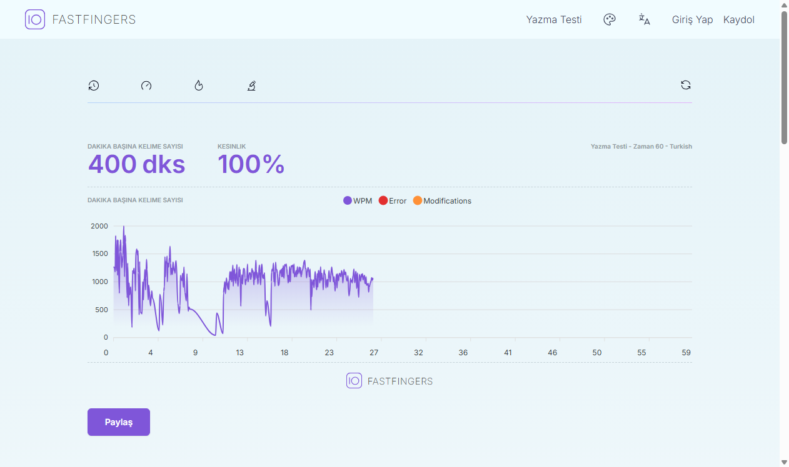
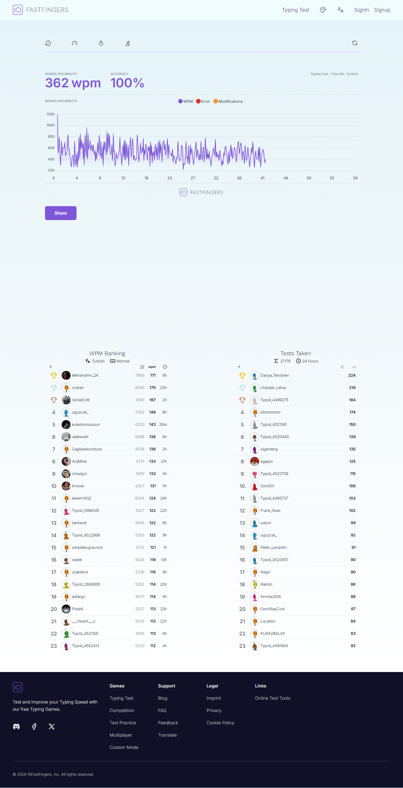
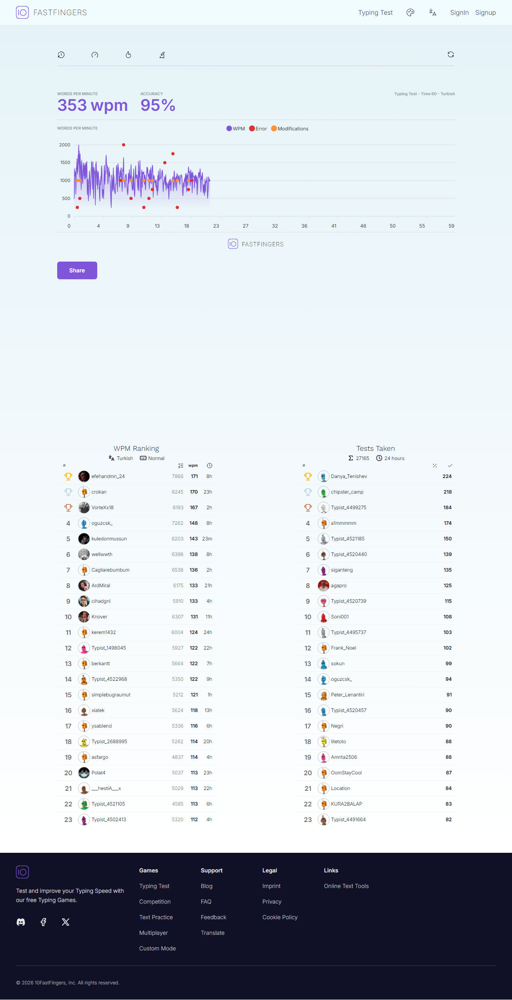

# Benchmarks

These results were captured against the real Turkish 10FastFingers test page on
2026-05-28.

The target page was:

```text
https://10fastfingers.com/typing-test/turkish
```

## Selenium Turbo

Command:

```bash
python selenium_bot.py --headless --strategy turbo --duration 60 --max-words 10000 --settle 12 --screenshot final_result_60s.png
```

Console output:

```text
Engine: selenium
Target: https://10fastfingers.com/typing-test/turkish
Strategy: turbo
Typed words: 2152
Elapsed: 60.0s
Screenshot: final_result_60s.png
```

Site result:

- WPM: 400 dks
- Accuracy: 100%



## Playwright Stable

Command:

```bash
python playwright_bot.py --headless --strategy active --duration 60 --max-words 10000 --delay 0.005 --settle 12 --screenshot final_result_60s_playwright_stable.png
```

Console output:

```text
Engine: playwright
Target: https://10fastfingers.com/typing-test/turkish
Strategy: active
Typed words: 609
Elapsed: 60.01s
Screenshot: final_result_60s_playwright_stable.png
```

Site result:

- WPM: 362 wpm
- Accuracy: 100%



## Playwright Aggressive

Command:

```bash
python playwright_bot.py --headless --strategy turbo --duration 60 --max-words 10000 --settle 12 --screenshot final_result_60s_playwright.png
```

Console output:

```text
Engine: playwright
Target: https://10fastfingers.com/typing-test/turkish
Strategy: turbo
Typed words: 3754
Elapsed: 60.01s
Screenshot: final_result_60s_playwright.png
```

Site result:

- WPM: 353 wpm
- Accuracy: 95%

This mode sends input faster, but the current site UI can miss state updates at
that speed. Use the stable Playwright command when accuracy matters.



## Notes

- Live-site results can change when 10FastFingers changes its frontend,
  throttling, scoring, or word rendering.
- Selenium currently gives the best verified score in this environment.
- Playwright still has the lower-overhead automation path, but the current site
  state updates need a tiny delay for 100% accuracy.
