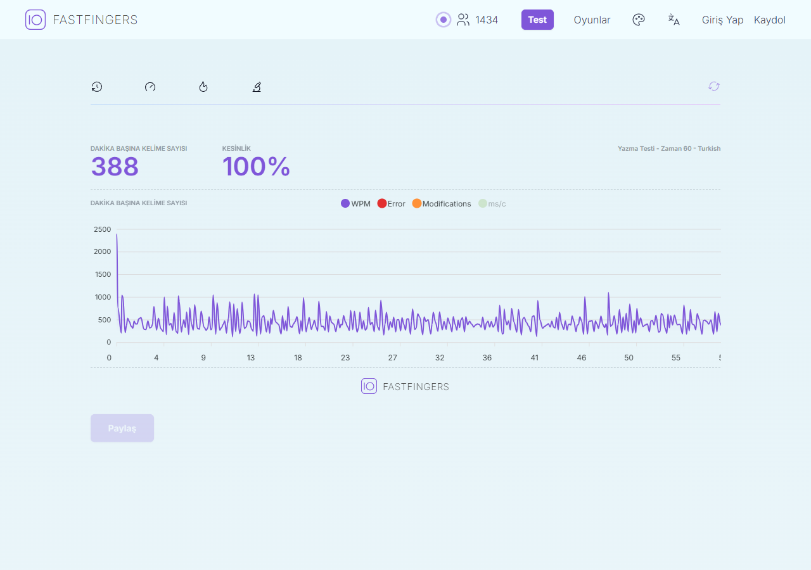
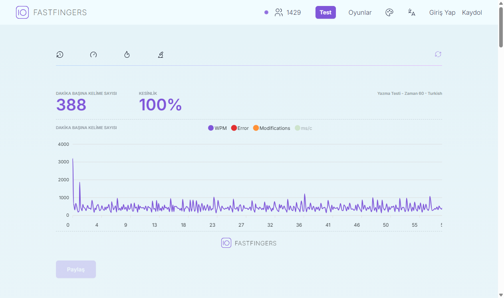

# Benchmarks

## 2026-09-24 — current implementation

Environment: Windows 11, Python 3.13.5, Selenium 4.49.0, Playwright 1.63.0,
websocket-client 1.9.2, Chrome 152.0.7977.64. Both engines used the same Chrome
executable, headless, with a 1280 × 900 viewport. Engine launch defaults still
differ; these are observations on one computer, not universal rankings.

### Local native-keyboard throughput

Three repetitions per profile, sequential runs, reversed profile order on the
second repetition. Every run submitted the same 120-word fixture containing
Turkish Unicode, uppercase letters and consecutive duplicate words. Startup,
navigation and screenshots are excluded. Both profiles used zero pacing and
zero artificial delay. Reported times are medians.

| Engine | Normal keyboard (`active --delay 0`) | CDP WebSocket (`turbo`) | Speedup |
| --- | ---: | ---: | ---: |
| Selenium | 1.438393 s | 0.300813 s | 4.78× |
| Playwright | 1.604102 s | 0.413316 s | 3.88× |

This compares the corrected native API path with the new pipeline. It does not
compare an old broken selector loop with successful typing. Selenium remained
faster on this machine even with the shared transport; a WebSocket alone does
not guarantee that Playwright wins. The Playwright turbo range was 0.321644–
0.584534 s, illustrating why single-run rankings are weak evidence.

[Raw runs and environment](docs/benchmarks/local-2026-09-24.json).

Reproduce from the repository root:

```bash
python scripts/benchmark.py --browser-path "PATH/TO/chrome" --repeats 3
```

The native-input regression suite separately checks correct text, trusted events,
repeated words, recycled rows and delayed rendering. The current suite has 18
tests, including four browser tests; the browser tests are opt-in locally and
run in the browser CI job. Screenshots and timing alone do not establish accuracy.

### Real Turkish test

Fresh anonymous browsers; no account login, competition entry, score rewriting,
or private application-state access. The commands used the same explicit Chrome
binary as the local comparison.

| Engine / profile | Confirmed UI words | Typing duration | Site WPM | Accuracy |
| --- | ---: | ---: | ---: | ---: |
| Playwright turbo, unlimited | 356 | 6.294455 s | Not measured | Not measured |
| Playwright turbo, `--wpm 400` | 352 | 59.782514 s | 388 | 100% |
| Selenium turbo, `--wpm 400` | 349 | 59.806722 s | 388 | 100% |

Each live run received a different random word list. UI word counts are therefore
not directly comparable. The unlimited run exhausted the offered text; its
6.29-second duration is not a 60-second WPM score. The paced runs reached the
site's result screen after the three-second screenshot wait.

```bash
python playwright_bot.py --headless --strategy turbo --duration 60 --wpm 400 --settle 3 --browser-path "PATH/TO/chrome" --json
python selenium_bot.py --headless --strategy turbo --duration 60 --wpm 400 --settle 3 --browser-path "PATH/TO/chrome" --json
```

[Live run data](docs/benchmarks/live-2026-09-24.json).





### Why the old numbers were misleading

The inspected live frontend sets `charactersLength: 2e3` for this test and its
text parser stops at that budget, including word separators. It does not supply
an unlimited stream of words. When that text is exhausted, no active word
remains, even if the 60-second timer is still running. The new adapter reports
`words_exhausted` and stops. It does not repeat a fallback word or count further
attempts. Idle input can trigger the site's AFK reset, so an unlimited burst
followed by a long sleep is not a completed timed test.

The current inspected configuration was in the site's public
[typing-test bundle](https://10fastfingers.com/_next/static/chunks/1_8fbmmak0vai.js);
that fingerprinted URL can change when the site is deployed. The corresponding
parser was in its public
[typing-state bundle](https://10fastfingers.com/_next/static/chunks/1rjhf4rbklnvf.js).
No global maximum score is asserted: scoring rules, character weights and the
frontend can change. `--wpm` is an input pacing request, not a promise of that score.

The old Playwright active loop also clicked for every word. Standard
[`keyboard.type()`](https://playwright.dev/python/docs/api/class-keyboard#keyboard-type)
uses input-only events for characters outside the US key mapping. The new modern
page path supplies native key events for these characters, and turbo sends a
bounded word's events through one CDP connection before checking UI progress.

## Historical records — 2026-05-28

These screenshots were already in the repository. They were not re-run as part
of the current benchmark, and their old console counters counted attempts.

| Old profile | Recorded site result | Screenshot |
| --- | --- | --- |
| Selenium turbo | 400 WPM, 100% | [image](docs/assets/selenium-turbo-400wpm-100acc.png) |
| Playwright active, delay 0.005 | 362 WPM, 100% | [image](docs/assets/playwright-stable-362wpm-100acc.png) |
| Playwright turbo | 353 WPM, 95% | [image](docs/assets/playwright-aggressive-353wpm-95acc.png) |

The old console claims of 2,152 or 3,754 “typed words” were not confirmed word
counts and must not be used to rank successful throughput.
